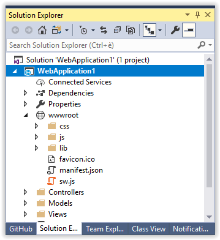

# Add PWA Support

<!-- Replace this badge with your own-->

<!-- Update the VS Gallery link after you upload the VSIX-->
Download this extension from the [VS Gallery](https://visualstudiogallery.msdn.microsoft.com/[GuidFromGallery])
or get the [CI build](http://vsixgallery.com/extension/AddPWASupport.c140d5d7-6be7-41da-a3b4-785f479b825d/).

---------------------------------------

This extension give you the feature to add PWA (Progressive Web APP) support for your web app 

See the [change log](CHANGELOG.md) for changes and road map.

## Features

- Added context button "Add PWA Support" to web project

### Add PWA Support Button
his button is enabled on web projects and clicking on it, it will add a manifest file and a server worker file to your project.

When extension is intalled you can see the Add PWA Support button on the project's context menu:

If click on the button you will see two PWA files: manifest.json e sw.js

Execute your web app and check your web app with lighthouse

## Contribute
Check out the [contribution guidelines](CONTRIBUTING.md)
if you want to contribute to this project.

For cloning and building this project yourself, make sure
to install the
[Extensibility Tools](https://marketplace.visualstudio.com/items?itemName=MadsKristensen.ExtensibilityTools)
extension for Visual Studio which enables some features
used by this project.

## License
[Apache 2.0](LICENSE)